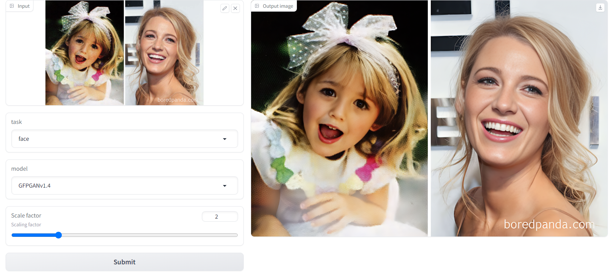
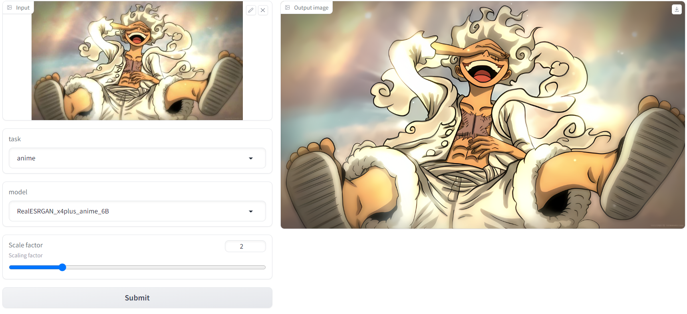

# ISR: General Image Super Resolution

[](https://huggingface.co/spaces/dragonSwing/isr) [](https://colab.research.google.com/github/binh234/isr/blob/main/notebooks/Super_Resolution.ipynb)

Practical algorithms for real-world Image/Video restoration and Face restoration. It leverages rich and diverse priors encapsulated in a pretrained GAN (e.g., StyleGAN2) for image super resolution.




## Install libraries

```bash
pip install -r requirements.txt
```

## Run Gradio App

```bash
gradio run app.py
```

## Command-line options

```bash
python upsample.py -i examples -o outputs
```

```bash
usage: upsample.py [-h] --input INPUT --output OUTPUT
                   [--upsampler {srcnn,RealESRGAN_x2plus,RealESRGAN_x4plus,RealESRNet_x4plus,realesr-general-x4v3,RealESRGAN_x4plus_anime_6B,realesr-animevideov3}]
                   [--face-enhancer {GFPGANv1.3,GFPGANv1.4,RestoreFormer}]
                   [--scale {1.5,2,2.5,3,3.5,4}] [--device DEVICE]

Runs automatic detection and mask generation on an input image or directory of
images

optional arguments:
  -h, --help            show this help message and exit
  --input INPUT, -i INPUT
                        Path to either a single input image or folder of
                        images.
  --output OUTPUT, -o OUTPUT
                        Path to the output directory.
  --upsampler {srcnn,RealESRGAN_x2plus,RealESRGAN_x4plus,RealESRNet_x4plus,realesr-general-x4v3,RealESRGAN_x4plus_anime_6B,realesr-animevideov3}
                        The type of upsampler model to load
  --face-enhancer {GFPGANv1.3,GFPGANv1.4,RestoreFormer}
                        The type of face enhancer model to load
  --scale {1.5,2,2.5,3,3.5,4}
                        scaling factor
  --device DEVICE       The device to run upsampling on.
```

## References

[GFPGAN](https://github.com/TencentARC/GFPGAN)
[Real-ESRGAN](https://github.com/xinntao/Real-ESRGAN)
